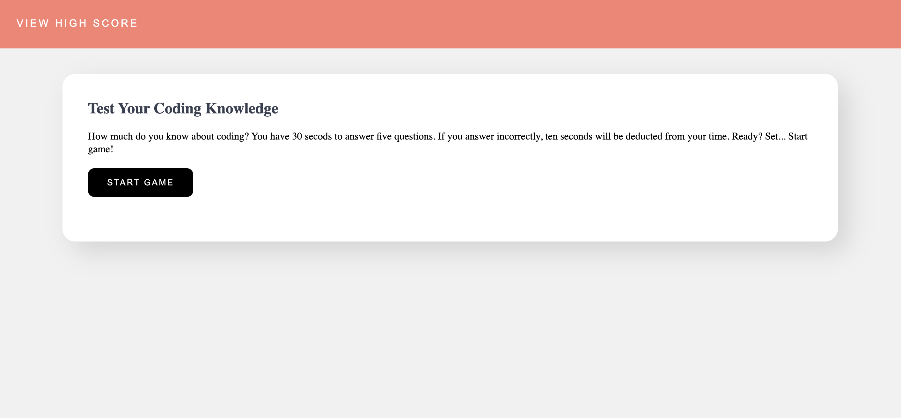
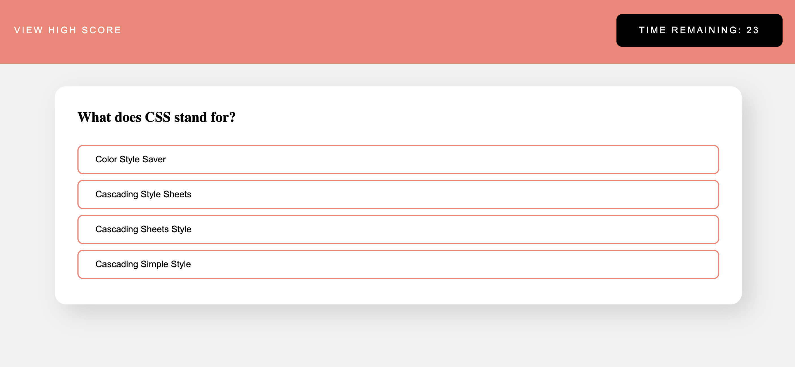
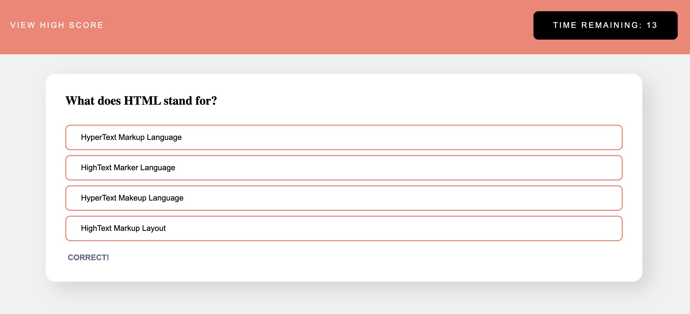

# Coding-Knowledge-Quiz

## Overview

Programmed a 5-question timed quiz to test players knowledge on coding. Players are able to view their scores, store them to keep a record, or clear them. The goal is simple, get all five questions right within the allotted 30 seconds. Wrong answers cost players 10 seconds off the clock.


## The Project

The coding quiz was built using HTML, CSS, and javascriipt, and is accessibile via the browser. When the player accesses the game, they are greeted with a welcome message that contains game instructions. Once the player clicks start, the welcome message is hidden and the timer starts counting down from 30 seconds. Player has five questions to answer within the alloted time, and are penalized ten seconds for each incorrect answer. Got it right? The word "correct" will pop up on the screen. Wrong? The program lets the player know by displaying "incorrect" below the questions. 

The game comes to an end when the player has answered all questions or time runs out. The program will inform the player how many questions they got correct out of the five presented to them, and give them the opportunity to enter their initials and save their scores. 

Scores are stored to the players local storage and displayed on a separate page. They can beat their own score or play with a friend. The scoreboard can be cleared with the click of a button if they want to start fresh. They can play again, and again, and again.


## Road Blocks

Before beginning the project, I began thinking through the requirements and writing out pseudocode. Based on my current understanding of javascript, there were a few things I knew I needed to include in the application's code: timer, local storage, if/else statements. Buttons and list items needed to be created dynamically. Seemed simple enough, but there were a few bumps in the road: 

- How do I display the next question? 
- How does the application verify if the players' answer is correct?

###### Displaying the next question

There seemed to be a simple solution to displaying the next question. Only, at the time, it felt like there was some magical formula I didn't have the receipe for. And really, it was simple...clear out the values and add one to the index. 

It looks like this:

    ```
    questionTitle.innerHTML = "";
    multipleChoiceButtons.innerHTML = "";
    currentQuestion ++;
    ```

###### Validating players' selection

While I understood the concept of using an operator to verify if two values match, figuring out what to match was a bit tricky. In the end, with the help of my awesome tutor and discussions with a classmate, I had an a-ha moment...match the correct answer to the button text. 

    ```
    choiceButton.addEventListener("click", function (event) {

      if (event.target.textContent === questionsData[currentQuestion].correctAnswer) {  
        score++;

      } else {
        secondsRemaining -= 10;  
      }
    });
    ```

## That's a wrap

After some trial and error, office hours attendance, Googling, tutoring and studying, the code locked into place and the application operates as per the requirements.  


## Take a Look

GitHub: https://github.com/jsamborski310/code-quiz

GitHub Pages: https://jsamborski310.github.io/Coding-Knowledge-Quiz/


## The Preview

Here's a live screencast of the password generator in action: 

https://www.loom.com/share/ec5f2971c8114607ae402c0f66d5aa73


###### Welcome Screen





###### Question





###### Question with Validation





###### Scoreboard


